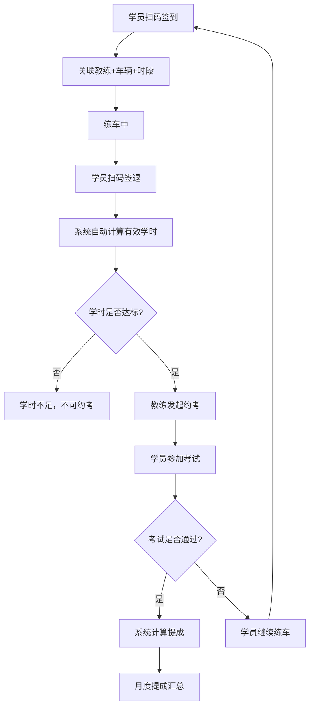

## 1. 产品概述

驾校教练端管理系统，面向驾校教练及管理员，实现学员管理、教练车排班、学时打卡、提成核算的全流程数字化管理。系统核心解决驾校日常运营中学员信息分散、排班冲突、学时统计困难、提成核算不透明等痛点，目标用户为驾校教练和驾校管理员。

## 2. 核心功能

### 2.1 用户角色

| 角色 | 注册方式 | 核心权限 |
|------|----------|----------|
| 教练 | 管理员分配账号 | 管理自己名下学员、查看排班、打卡签到签退、查看提成 |
| 管理员 | 系统预设 | 全局学员管理、车辆排班、提成设置、数据统计 |

### 2.2 功能模块

1. **仪表盘**：关键数据概览（在训学员数、今日排班、待约考学员、本月提成）
2. **学员管理**：科目二/科目三代教名单、练车进度追踪、约考状态管理、学时不足自动拦截
3. **教练车排班**：车辆+教练+时段三维排班，支持日/周视图，冲突检测
4. **学时打卡**：学员扫码签到/签退，自动计算有效学时，学时不足约考拦截
5. **提成核算**：按学员通过人数×提成单价计算，月度汇总，明细可查

### 2.3 页面详情

| 页面名称 | 模块名称 | 功能描述 |
|----------|----------|----------|
| 仪表盘 | 数据卡片 | 在训学员总数、今日排班数、待约考学员、本月提成金额 |
| 仪表盘 | 最近打卡记录 | 最新10条签到签退记录实时展示 |
| 仪表盘 | 学时预警 | 列出学时不足的学员，一键跳转详情 |
| 学员管理 | 学员列表 | 按科目二/科目三分栏展示代教学员，支持搜索、筛选 |
| 学员管理 | 学员详情 | 基本信息、练车进度时间线、学时累计、约考状态 |
| 学员管理 | 约考管理 | 发起约考申请，学时不足时自动拦截并提示 |
| 学员管理 | 进度追踪 | 可视化展示学员科目进度（科目一~科目四） |
| 教练车排班 | 排班日历 | 日/周视图展示排班，拖拽式创建排班 |
| 教练车排班 | 排班创建 | 选择车辆、教练、时段，冲突检测提示 |
| 教练车排班 | 车辆管理 | 车辆信息维护（车牌、车型、状态） |
| 学时打卡 | 扫码签到 | 学员上车扫码签到，记录时间、教练、车辆 |
| 学时打卡 | 扫码签退 | 学员下车扫码签退，自动计算有效学时 |
| 学时打卡 | 打卡记录 | 按日期、学员、教练筛选打卡记录 |
| 提成核算 | 提成总览 | 按月展示各教练通过人数及提成金额 |
| 提成核算 | 提成明细 | 单个教练的学员通过明细，提成单价设置 |
| 提成核算 | 提成设置 | 配置各科目提成单价、结算规则 |

## 3. 核心流程

### 3.1 学员练车打卡流程

学员到达训练场 → 扫码签到（关联教练+车辆+时段）→ 开始练车 → 练车结束扫码签退 → 系统自动计算有效学时 → 累加至学员总学时 → 学时达标后可发起约考申请

### 3.2 约考拦截流程

教练为学员发起约考 → 系统检查该科目已累计学时 → 学时不足：拦截并提示"学时不足，需补齐X小时" → 学时达标：允许约考，更新状态为"已约考"

### 3.3 提成核算流程

学员通过科目考试 → 管理员确认通过 → 系统按科目提成单价计算提成 → 累加至教练月度提成 → 月底生成提成报表

## 4. 用户界面设计

### 4.1 设计风格

- **主色调**：深青色 (#0F766E) 搭配琥珀色 (#D97706) 点缀，传递专业与活力
- **辅助色**：石板灰系（zinc）作为中性色，提供清晰的信息层级
- **按钮风格**：圆角微凸（rounded-lg），主操作深青色实心，次要操作描边
- **字体**：标题使用 DM Sans（几何感、现代），正文使用 Noto Sans SC（中文优化、清晰）
- **布局风格**：左侧导航 + 右侧内容区，卡片式模块布局，数据表格圆角化
- **图标风格**：Lucide 线性图标，2px 描边，与整体风格统一

### 4.2 页面设计概览

| 页面名称 | 模块名称 | UI 元素 |
|----------|----------|---------|
| 仪表盘 | 数据卡片 | 4列网格，深青色渐变背景卡片，数字大号加粗，图标右上角 |
| 仪表盘 | 最近打卡 | 圆角表格，斑马纹行，签到绿色标签/签退橙色标签 |
| 仪表盘 | 学时预警 | 红色警告图标+文字列表，hover 侧滑显示详情 |
| 学员管理 | 学员列表 | 顶部Tab切换科目二/科目三，搜索栏+状态筛选，圆角卡片列表 |
| 学员管理 | 学员详情 | 左侧信息卡片，右侧进度时间线，底部学时统计条 |
| 学员管理 | 约考管理 | 模态弹窗表单，学时不足时红色警告横幅+拦截提示 |
| 教练车排班 | 排班日历 | 日历网格，深青色排班块，hover 显示详情tooltip |
| 教练车排班 | 排班创建 | 侧滑抽屉表单，下拉选择教练/车辆/时段，冲突红色提示 |
| 学时打卡 | 扫码区 | 大号二维码展示区（教练展示，学员扫码），下方实时状态 |
| 学时打卡 | 打卡记录 | 日期选择器+筛选器，圆角表格，签到/签退时间列高亮 |
| 提成核算 | 提成总览 | 月度选择器，教练卡片网格，金额大号数字+通过人数标签 |
| 提成核算 | 提成明细 | 展开式行详情，学员姓名+科目+通过日期+提成金额 |

### 4.3 响应式设计

- 桌面优先设计，最小宽度 1280px
- 侧边栏可折叠，内容区自适应
- 表格在窄屏下切换为卡片列表

### 4.4 3D 场景

不适用
