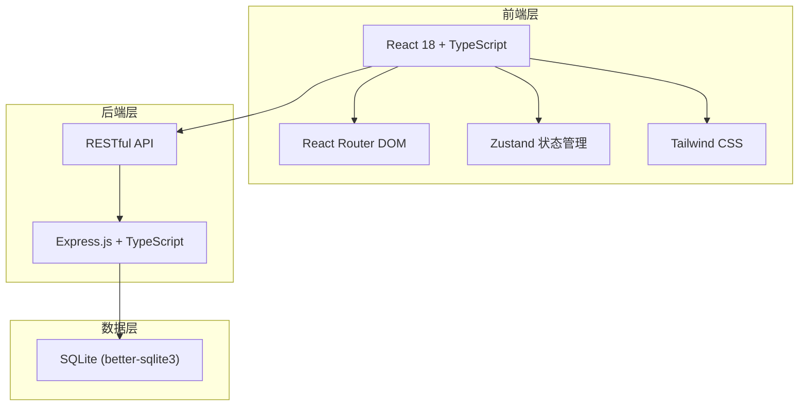
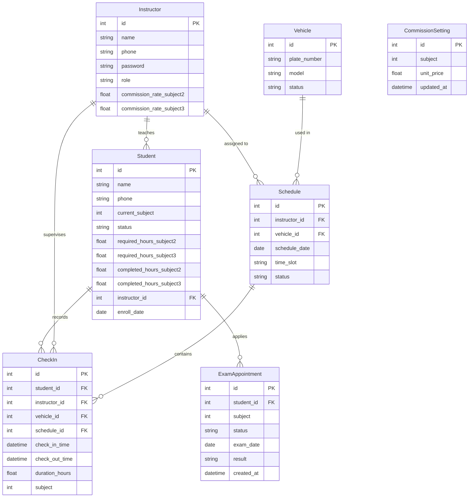

## 1. 架构设计



## 2. 技术说明

- 前端：React@18 + TypeScript + Tailwind CSS@3 + Vite
- 初始化工具：vite-init (react-express-ts 模板)
- 后端：Express@4 + TypeScript (ESM)
- 数据库：SQLite (better-sqlite3)，内置 mock 数据
- 状态管理：Zustand
- 图标库：lucide-react

## 3. 路由定义

| 路由 | 用途 |
|------|------|
| / | 仪表盘，数据概览 |
| /students | 学员管理列表 |
| /students/:id | 学员详情 |
| /scheduling | 教练车排班日历 |
| /checkin | 学时打卡（扫码签到签退） |
| /commission | 提成核算总览 |

## 4. API 定义

### 4.1 学员管理

```
GET    /api/students          - 获取学员列表（支持 ?subject=2|3&keyword=&status=）
GET    /api/students/:id      - 获取学员详情
POST   /api/students          - 新增学员
PUT    /api/students/:id      - 更新学员信息
POST   /api/students/:id/exam - 发起约考（含学时校验拦截）
```

### 4.2 教练车排班

```
GET    /api/schedules         - 获取排班列表（支持 ?date=&week=）
POST   /api/schedules         - 创建排班（含冲突检测）
DELETE /api/schedules/:id     - 删除排班
GET    /api/vehicles          - 获取车辆列表
POST   /api/vehicles          - 新增车辆
```

### 4.3 学时打卡

```
POST   /api/checkins          - 签到（学员ID+教练ID+车辆ID）
PUT    /api/checkins/:id      - 签退（自动计算学时）
GET    /api/checkins          - 获取打卡记录（支持 ?date=&studentId=）
GET    /api/checkins/active   - 获取当前未签退的记录
```

### 4.4 提成核算

```
GET    /api/commissions       - 获取提成汇总（支持 ?month=&year=）
GET    /api/commissions/:instructorId - 获取教练提成明细
PUT    /api/commissions/settings      - 更新提成单价设置
GET    /api/commissions/settings      - 获取提成设置
```

### 4.5 仪表盘

```
GET    /api/dashboard/stats   - 获取仪表盘统计数据
GET    /api/dashboard/recent-checkins - 获取最近打卡记录
GET    /api/dashboard/hours-warning    - 获取学时预警列表
```

## 5. 数据模型

### 5.1 数据模型定义



### 5.2 数据定义语言

```sql
CREATE TABLE instructor (
    id INTEGER PRIMARY KEY AUTOINCREMENT,
    name TEXT NOT NULL,
    phone TEXT NOT NULL UNIQUE,
    password TEXT NOT NULL,
    role TEXT NOT NULL DEFAULT 'instructor',
    commission_rate_subject2 REAL NOT NULL DEFAULT 200,
    commission_rate_subject3 REAL NOT NULL DEFAULT 300
);

CREATE TABLE vehicle (
    id INTEGER PRIMARY KEY AUTOINCREMENT,
    plate_number TEXT NOT NULL UNIQUE,
    model TEXT NOT NULL,
    status TEXT NOT NULL DEFAULT 'available'
);

CREATE TABLE student (
    id INTEGER PRIMARY KEY AUTOINCREMENT,
    name TEXT NOT NULL,
    phone TEXT NOT NULL UNIQUE,
    current_subject INTEGER NOT NULL DEFAULT 2,
    status TEXT NOT NULL DEFAULT 'training',
    required_hours_subject2 REAL NOT NULL DEFAULT 16,
    required_hours_subject3 REAL NOT NULL DEFAULT 24,
    completed_hours_subject2 REAL NOT NULL DEFAULT 0,
    completed_hours_subject3 REAL NOT NULL DEFAULT 0,
    instructor_id INTEGER NOT NULL REFERENCES instructor(id),
    enroll_date TEXT NOT NULL DEFAULT (date('now'))
);

CREATE TABLE schedule (
    id INTEGER PRIMARY KEY AUTOINCREMENT,
    instructor_id INTEGER NOT NULL REFERENCES instructor(id),
    vehicle_id INTEGER NOT NULL REFERENCES vehicle(id),
    schedule_date TEXT NOT NULL,
    time_slot TEXT NOT NULL,
    status TEXT NOT NULL DEFAULT 'scheduled',
    UNIQUE(instructor_id, schedule_date, time_slot),
    UNIQUE(vehicle_id, schedule_date, time_slot)
);

CREATE TABLE check_in (
    id INTEGER PRIMARY KEY AUTOINCREMENT,
    student_id INTEGER NOT NULL REFERENCES student(id),
    instructor_id INTEGER NOT NULL REFERENCES instructor(id),
    vehicle_id INTEGER NOT NULL REFERENCES vehicle(id),
    schedule_id INTEGER REFERENCES schedule(id),
    check_in_time TEXT NOT NULL DEFAULT (datetime('now')),
    check_out_time TEXT,
    duration_hours REAL,
    subject INTEGER NOT NULL DEFAULT 2
);

CREATE TABLE exam_appointment (
    id INTEGER PRIMARY KEY AUTOINCREMENT,
    student_id INTEGER NOT NULL REFERENCES student(id),
    subject INTEGER NOT NULL,
    status TEXT NOT NULL DEFAULT 'pending',
    exam_date TEXT,
    result TEXT,
    created_at TEXT NOT NULL DEFAULT (datetime('now'))
);

CREATE TABLE commission_setting (
    id INTEGER PRIMARY KEY AUTOINCREMENT,
    subject INTEGER NOT NULL UNIQUE,
    unit_price REAL NOT NULL,
    updated_at TEXT NOT NULL DEFAULT (datetime('now'))
);

CREATE INDEX idx_student_instructor ON student(instructor_id);
CREATE INDEX idx_checkin_student ON check_in(student_id);
CREATE INDEX idx_checkin_instructor ON check_in(instructor_id);
CREATE INDEX idx_schedule_date ON schedule(schedule_date);
CREATE INDEX idx_exam_student ON exam_appointment(student_id);

INSERT INTO commission_setting (subject, unit_price) VALUES (2, 200);
INSERT INTO commission_setting (subject, unit_price) VALUES (3, 300);
```
